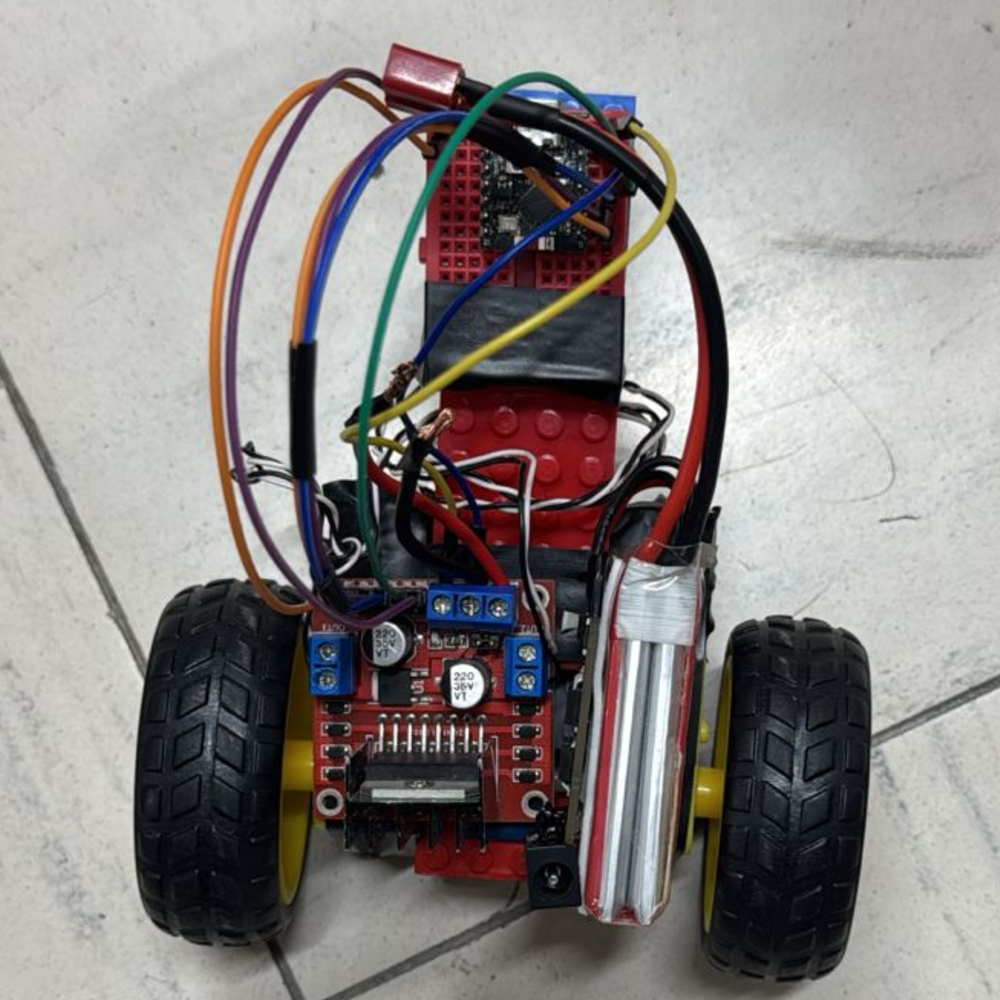

# ESP32-C3 MultiControl Car



Un sistema de control multimodal para carritos robóticos utilizando el ESP32-C3 Super Mini, implementando 5 métodos diferentes de control inalámbrico.

## Características Principales

- ✅ **Control por BLE (Integrado)**
  - Con aplicación MIT App Inventor
  - Con mando Dualshock 4 (PS4)
  
- 📶 **Control por Bluetooth Clásico (HC-06)**
  - Con aplicación MIT App Inventor
  - Con mando Dualshock 4 (PS4)

- ☁️ **Control IoT por Ubidots**
  - Interfaz web personalizada
  - Control remoto desde cualquier lugar

- 📡 **Control por RF (NRF24L01)**
  - Comunicación punto a punto con otro ESP32 (S2)
  - Baja latencia

## Configuración Rápida

1. Clona el repositorio:
   ```bash
   git clone https://github.com/tuusuario/ESP32-C3-MultiControl-Car.git